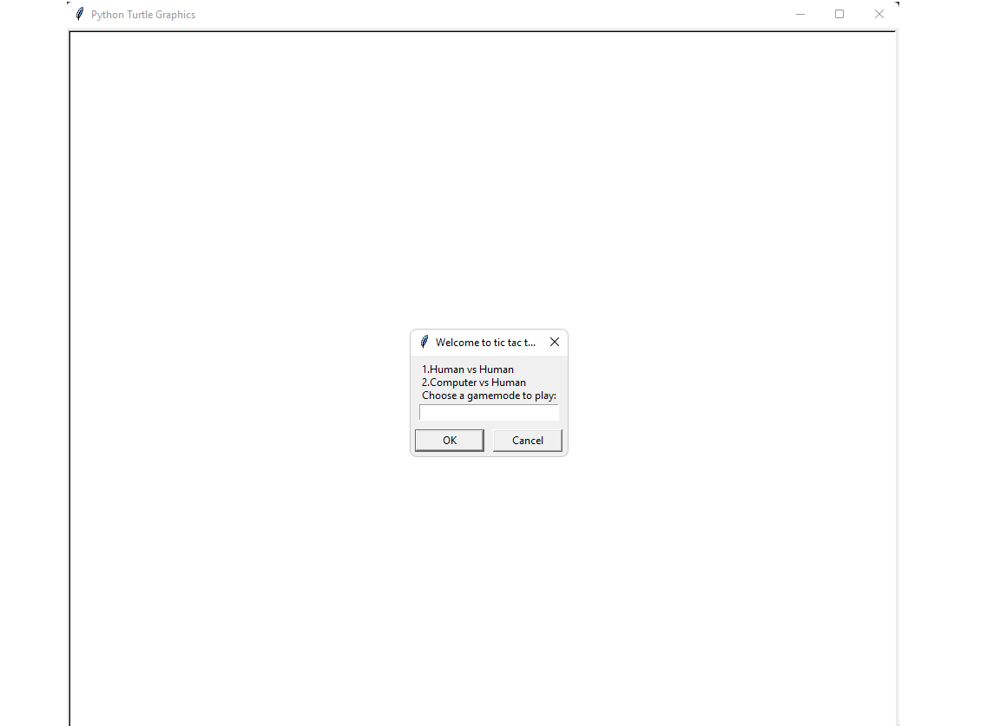
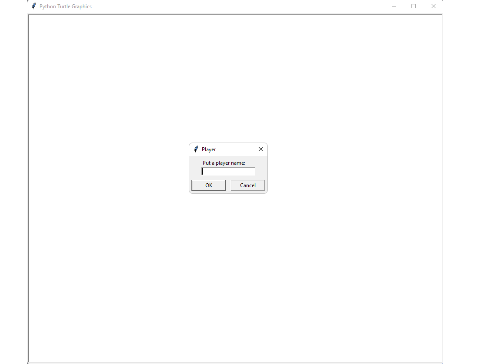
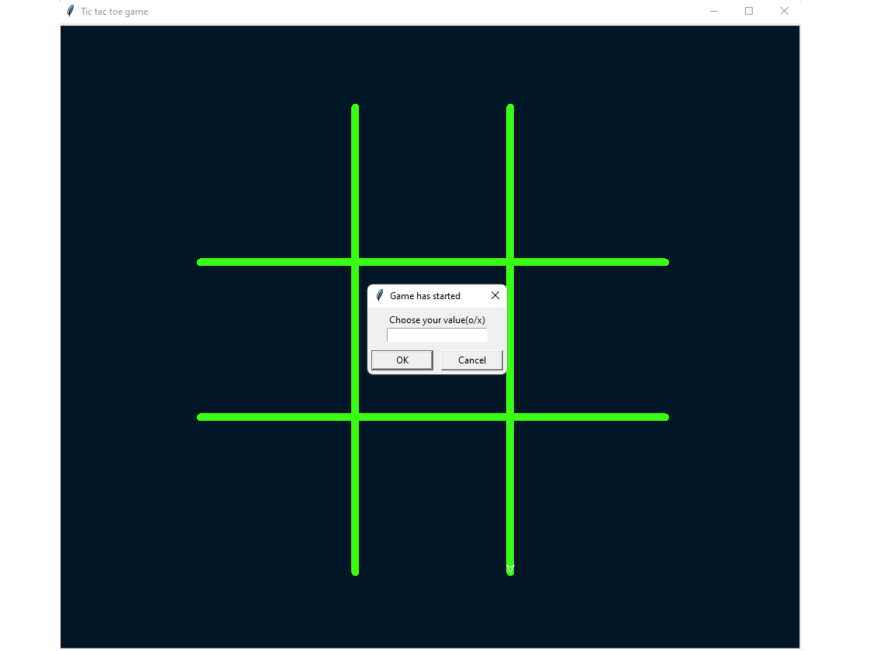
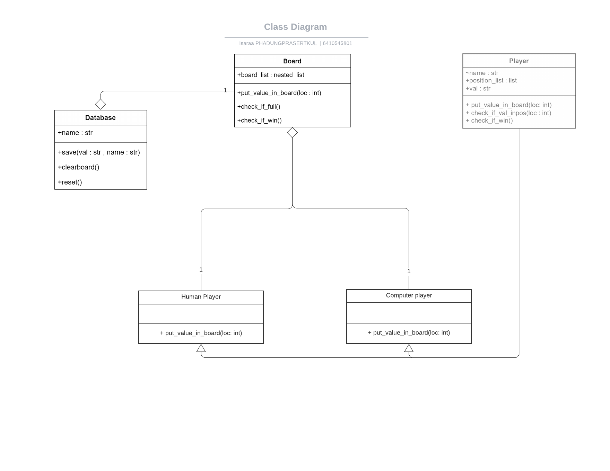

# Tic tac toe Game
## About this project

This is a tic tac toe game that contains 2 game modes which are Human VS Human and Human VS Computer.
The game will plays turn by turn until the game is draw or someone has already matches win conditions.
The game will stop and reset board and update wincount in that gamemode into CSV file.

This program is a part of the 01219114 Computer Programming I made by Isaraa Phadungprasertkul 6410545801

**This program contain 2 main features**
- play with human
- play with computer

When user start a program it will ask which gamemode did user want to play

I will choose Computer Vs Human

It will asking user to put any name

And then user will choose O or X value to start a game

After that the game will started normally until the game is over

## Requirement

The requirement program for this project 
### Python
* [Python 3.10](https://www.python.org/downloads/)

**Note** You can user an older version of python to play this game too.

## Program design

* `Database` : Read and collecting wincount data for each gamemode.
* `Board` : Create a tic tac toe board and collecting player data.
* `Player` : Collecting a player name.
* `Human Player` : Collect a location of mark that valid into a board.
* `Computer Player` : Collect a random location of mark that valid into a board

## Code structure
This program contains five python files and one CSV file to collect a data
* [database.py](database.py) : module file that contain `savedata` class
* [Board.py](Board.py) : module file that contain `Board` class
* [Game.py](Game.py) : Module file that contain `Game` class
* [Player](player.py) : Module file that contain `Player`, `Human_Player` and `Computer Player` class
* [main](main.py): Main file that used to run a main program
